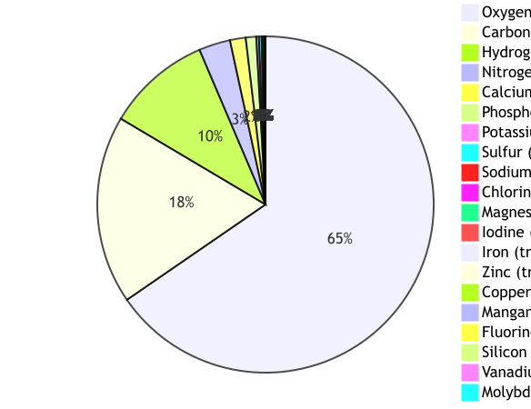
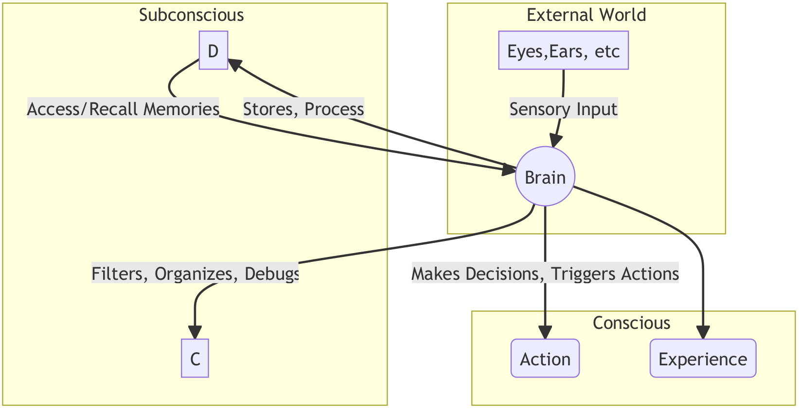
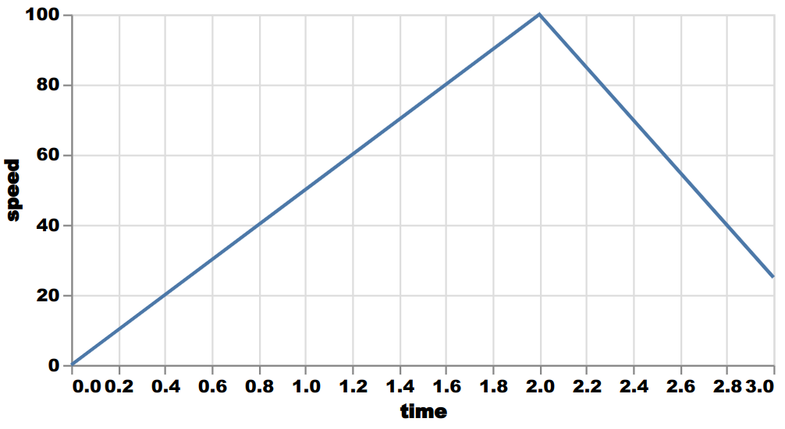

# natlagram, convert natural language to diagrams

Natlagram builds on OpenAI's API and [Kroki](https://kroki.io/) to generate infographics from natural language descriptions.
Read our upcoming article to learn more about its capabilities, limitations and inner workings.

## Examples

Natlagram is accessible from a command-line interface (CLI).

It can generate a variety of diagram types such as pie charts, node-edge graphs, line plots and timelines.
In the following examples, the user prompt is shown italicized followed by the natlagram generated image.

*What are the 20 most common elements in the human body? Make a pie chart.*

*How does the brain work? Simplify as needed.*

*Plot time on the x-axis against speed on the y-axis. At t=1h velocity=50 km/h, at t=2h, velocity=100 km/h, at t=3h, velocity=25 km/h.*

*Make a timeline of the winners of soccer world cups from 1990 to 2014.*

## Installation

The installation instructions and natlagram have been tested on Ubuntu 22.04.

If you have Docker and Docker compose installed, run the following to start Kroki.

    cd path/to/project/devops
	sudo docker compose up -d

If you don’t have Docker and Compose, we’ve provided an Ansible script to ease the installation.
First, install Ansible.

sudo apt install ansible

Then, run the playbook and start Kroki afterwards.

    cd path/to/project/devops
	ansible-playbook -i hosts.ini kroki_playbook.yml -K

Next, install the required Python packages.

    cd path/to/project
	pip3 install -r requirements.txt

Lastly, set up your OpenAI API key.
For this purpose, create a file called secret.py at the location path/to/project/src/secret.py and add the following text, replacing the contents of the string appropriately.
You can find your key, here.

    OPENAI_API_KEY = "YOUR KEY HERE"

You should be ready to start the CLI.

	python3 src/main.py

## License

Copyright (c) 2023 itemis AG
All rights reserved.

This source code is [licensed](LICENSE.md) under the MIT license found in the license file in the root directory of this source tree.

## Contact

Feel free to contact us directly with questions.

rafael.tappe.maestro@itemis.com